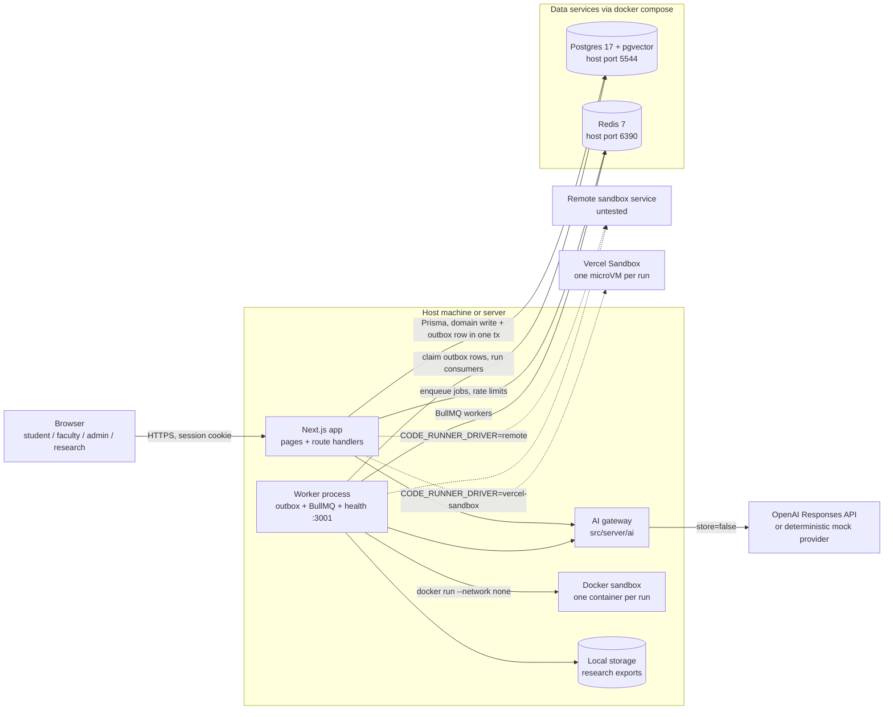
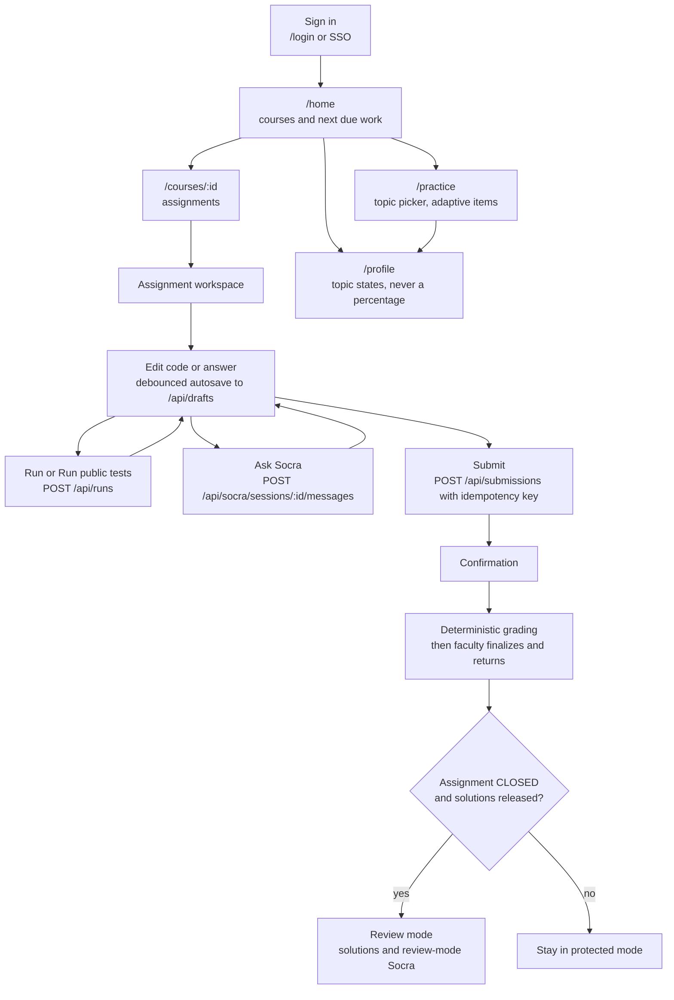
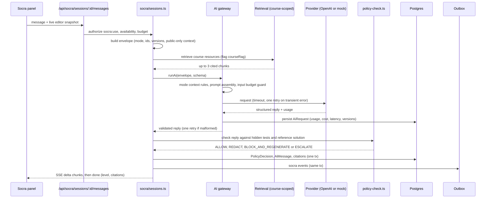
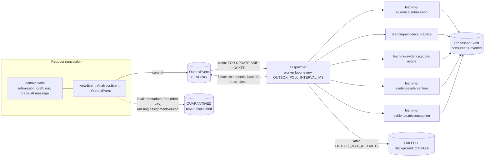
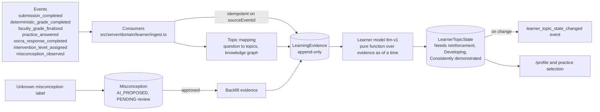
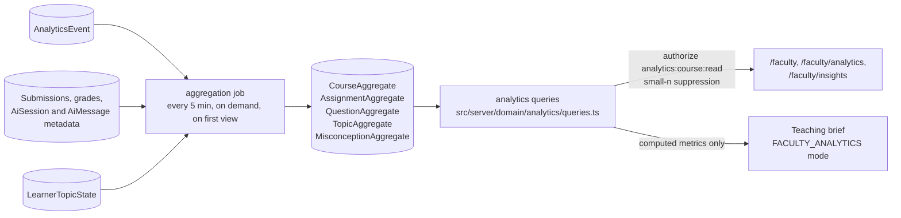
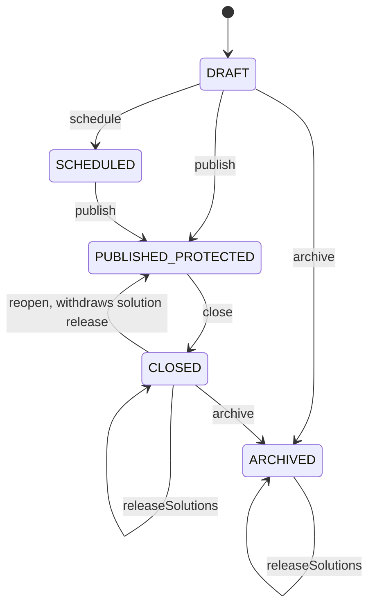
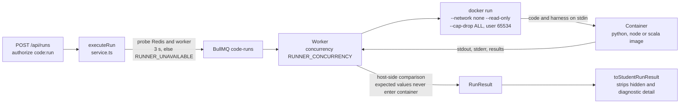
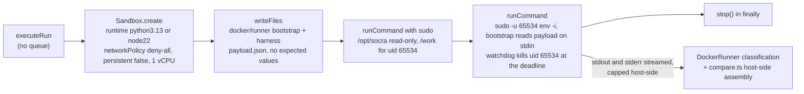

# Architecture

Socra Pilot Research V1 is a single Next.js application plus one background worker, backed by Postgres (with
pgvector) and Redis. Student code runs in throwaway Docker containers. Everything is verified against the code in this
repository; where a claim depends on a specific file, the path is given.

Related documents: [SECURITY.md](SECURITY.md), [KNOWN_LIMITATIONS.md](KNOWN_LIMITATIONS.md),
[ASSUMPTIONS.md](ASSUMPTIONS.md), [LEARNER_MODEL.md](LEARNER_MODEL.md),
[ANALYTICS_DICTIONARY.md](ANALYTICS_DICTIONARY.md), [RESEARCH_DATA_DICTIONARY.md](RESEARCH_DATA_DICTIONARY.md),
[BUILD_STATUS.md](BUILD_STATUS.md).

## 1. Components

| Component         | What it is                                                                                          | Code                                   |
| ----------------- | --------------------------------------------------------------------------------------------------- | -------------------------------------- |
| Web app           | Next.js 16 App Router. Pages plus thin route handlers: parse (zod), authorize, call a domain service | `src/app`, `src/proxy.ts`              |
| Domain services   | All business logic. Server-only (`import "server-only"`)                                            | `src/server/domain/*`                  |
| AI gateway        | The only path to a model. Mode policy, context assembly, budget, provider, persistence              | `src/server/ai`                        |
| Worker            | Separate Node process. Outbox dispatcher, BullMQ workers, health server on `:3001`                  | `worker/`                              |
| Postgres          | System of record. pgvector for embeddings, full-text search, append-only triggers                   | `prisma/schema.prisma`, `prisma/migrations` |
| Redis             | BullMQ queues, login rate limiting, run job payloads (deleted on completion, 60 s at most)           | `src/server/queues.ts`, `redis.ts`     |
| Code runner       | Docker driver (default), Vercel Sandbox driver (serverless) or a remote HTTP driver. Never runs inside the Next.js process | `src/server/runner`, `docker/runner`   |
| Object storage    | `local` driver writes under `LOCAL_STORAGE_DIR` (used by research exports). `s3` is a stub that throws                          | `src/server/domain/research/storage.ts` |

The web app and the worker share the same `src/server` code. Code reachable from `worker/**` must not import
`next/*`, `react` or `@/server/auth/current-user` (use `@/server/auth/principal`); see `docs/_CONTRACTS.md`.

## 2. System architecture

Seven BullMQ queues exist (`QUEUE_NAMES` in `src/server/queues.ts`): `code-runs`, `embeddings`, `aggregation`,
`exports`, `retention`, `grading`, `learner`. Registered processors (see `worker/processors.ts`,
`worker/jobs/aggregate.ts`, `worker/jobs/retention.ts`): `code-runs`, `embeddings`, `exports`, `aggregation`, `learner`
and `retention`. The `grading` queue has no processor; grading runs in the web process via Next's `after()`
(see [KNOWN_LIMITATIONS.md](KNOWN_LIMITATIONS.md)).

## 3. Module map

| Directory                           | Responsibility                                                                                            |
| ----------------------------------- | --------------------------------------------------------------------------------------------------------- |
| `src/app/(public)`                  | Login page                                                                                                 |
| `src/app/(student)`                 | Home, courses, assignment workspace and review mode, practice, profile, history, privacy, how Socra works |
| `src/app/(faculty)/faculty`         | Overview, assignments (new, edit, preview, submissions), grading, analytics, insights, materials, roster  |
| `src/app/(admin)/admin`, `/research` | System admin (courses, roster, flags, AI config, usage, audit, jobs, health) and research (participants, exports) |
| `src/app/api`                       | Route handlers by domain: auth, me, health, drafts, runs, submissions, assignments, grading, socra, practice, learner, analytics, resources, faculty (copilot, brief), admin, research |
| `src/proxy.ts`                      | Optimistic redirect to `/login` when the session cookie is absent. Not an authorization boundary          |
| `src/components`                    | `ui` primitives, `shell`, `workspace` (editor, console), `socra` (panel), `practice`, `auth`              |
| `src/server/env.ts`                 | Zod-validated environment; derives `AI_MOCK_MODE`; production requires `SESSION_SECRET`, `RESEARCH_PSEUDONYM_SECRET`, `DATABASE_URL`, `REDIS_URL` |
| `src/server/auth`                   | Sessions, local login, OIDC adapter, rate limit, `rbac.ts` (`can`, `assertCan`, `PERMISSIONS`), principal loading |
| `src/server/http.ts`                | `route()` wrapper, `assertSameOrigin`, `clientIp`, error mapping                                          |
| `src/server/ai`                     | `gateway.ts`, `modes/*` (per-mode policy and context rules), `providers/{mock,openai}.ts`, `policy-check.ts`, `cost.ts`, `schemas.ts` |
| `src/server/events`                 | `taxonomy.ts` (event names and schemas), `envelope.ts`, `outbox.ts` (`writeEvent`), `dispatcher.ts`, `consumers/`, `pseudonym.ts` |
| `src/server/runner`                 | `docker-runner.ts`, `docker-args.ts`, `vercel-sandbox-runner.ts`, `remote-runner.ts`, `scala-job.ts`, `compare.ts`, `service.ts` (`executeRun`) |
| `src/server/flags`, `audit`         | Feature flags; append-only audit writer                                                                    |
| `src/server/domain/assignments`     | Authoring service, student queries, pure state machine, versioned snapshots                                |
| `src/server/domain/workspace`       | Drafts (optimistic concurrency), runs, AI-safe workspace context                                           |
| `src/server/domain/submissions`, `grading` | Idempotent submissions, deterministic grading, rubric, overrides, AI grading suggestions           |
| `src/server/domain/socra`           | Socra sessions, budget, protected-turn orchestration, privileged raw transcript read                       |
| `src/server/domain/authoring-ai`    | Faculty copilot, policy test, written-grade suggestion, teaching brief                                     |
| `src/server/domain/resources`       | Chunking, ingest, versioned chunks, course-scoped hybrid retrieval                                         |
| `src/server/domain/practice`        | Item selection, answer checking, adaptation, live generation                                               |
| `src/server/domain/learner`         | Learner model `ltm-v1`: evidence ingest, topic-state recompute, profile                                    |
| `src/server/domain/knowledge-graph`, `misconceptions` | Topic graph recursive CTEs; misconception resolution and review                       |
| `src/server/domain/analytics`       | Metric definitions, aggregation job, queries (aggregates only)                                             |
| `src/server/domain/research`        | Field allowlist, pseudonymous export builder, storage                                                      |
| `src/server/domain/training`, `retention` | Model-improvement curation gates; retention reporting and enforcement                                |
| `src/server/domain/admin`           | Admin services (courses, roster CSV, flags, AI config, usage, jobs, health, audit view)                    |
| `worker/`                           | `index.ts` (outbox loop, queue workers, health), `processors.ts`, `jobs/*`                                 |
| `docker/runner`                     | Sandbox images and in-container harnesses (Python, Node, Scala)                                            |
| `prisma/`                           | Schema (77 models), 2 migrations, deterministic seed in `prisma/seed`                                      |
| `tests/`                            | `unit`, `integration` (needs docker Postgres), `e2e` (Playwright)                                          |

## 4. The four data planes

The planes are logical, not separate databases. Each has its own tables, privacy class and access rule.

| Plane                    | Contents                                                                                             | Who can read it                                   |
| ------------------------ | ---------------------------------------------------------------------------------------------------- | ------------------------------------------------- |
| 1. Transactional truth   | Users, courses, assignments (versioned), drafts, code runs, submissions, grades, AI sessions and messages | Owners and authorized staff through `can()`; raw AI messages only through the privileged path |
| 2. Learning evidence     | `LearningEvidence` (append-only), `LearnerTopicState`, misconception observations                    | The student (own profile); faculty see aggregates   |
| 3. Analytics and research | `AnalyticsEvent` (append-only), `*Aggregate` tables, pseudonymous research exports, study conditions | Faculty: aggregates with small-n suppression. Research admin: allowlisted export fields |
| 4. Model improvement     | `TrainingCandidate` curation, dataset versions, `HeldOutEvalItem`. Nothing enters automatically      | Research admin, after nine gates and review        |

Planes are connected only through the transactional outbox described in section 7. Domain services never write
evidence or aggregates directly in the request path; they emit events, and consumers in the worker derive the rest.

## 5. Student flow

Submitting never unlocks solutions. Review mode needs `state = CLOSED` and `solutionsReleased = true`
(`src/server/domain/assignments/state-machine.ts`, `src/server/domain/workspace/context.ts`).

## 6. AI request flow

All model calls go through `runAi` or `streamAi` in `src/server/ai/gateway.ts`. For a protected-assessment Socra turn
the sequence is:

Step by step:

1. **Envelope** (`AiRequestEnvelope` in `src/server/ai/types.ts`): mode, task, trace id, user, course, assignment,
   question, session, research condition, prompt and policy versions, assignment and question versions, sanitized
   workspace, latest execution (public test output only), retrieved resources, conversation.
2. **Mode policy**: `src/server/ai/modes/*` define per-mode context rules, prompt version, output handling.
   `PROTECTED_ASSESSMENT` sets `hiddenTests: false`, `referenceSolution: false`, `learnerProfile: false`.
3. **Context assembly**: `applyContextRules` drops anything the mode forbids; the oldest conversation turns are
   dropped until the rough token estimate fits `AI_MAX_INPUT_TOKENS_PER_REQUEST`.
4. **Retrieval**: `retrieveCourseResources` is hard-scoped by course, resource status, current version and access
   scope. Mock mode uses full-text search; with a key and embeddings it fuses pgvector cosine and full-text results.
5. **Provider**: `MockAiProvider` when `AI_MOCK_MODE`, else `OpenAiProvider` (Responses API, `store: false`). Models
   route by task tier (`TASK_TIERS` in `src/server/ai/provider.ts`): protected tier for Socra turns, grading suggestions,
   authoring and review; economy tier for practice, misconception extraction and analytics briefs.
6. **Policy check** (protected mode only): `checkProtectedOutput`, checker `rules-v1`. One regeneration is attempted
   with the violation explained; a second failure becomes a fixed safe fallback reply and an `ESCALATE` decision.
7. **Persistence**: `AiRequest` (always), `PolicyDecision`, `AiMessage`, `RetrievalCitation`.
8. **Events** (`src/server/domain/socra/sessions.ts`): `socra_session_started`, `socra_prompt_sent`,
   `socra_response_completed`, `intervention_level_assigned`, `course_resource_retrieved`, `socra_escalated`,
   `socra_limit_reached`, `socra_response_failed`.

Protected-mode replies are buffered (validated and policy-checked in full) and then streamed to the browser in small
chunks; they are never streamed raw from the model. Provider failures return `{ ok: false }` and the student sees
"Socra is unavailable" while editing, running and submitting keep working. Budget and rate limits (`budget.ts`):
per-session turns, per-user daily turns, per-minute rate, per-course spend, and a kill switch.

### AI modes

| Mode                       | Used for                                       | Hidden tests | Reference solution       | Learner profile |
| -------------------------- | ---------------------------------------------- | ------------ | ------------------------ | --------------- |
| `PROTECTED_ASSESSMENT`     | Socratic help on an open assignment            | never        | never                    | no              |
| `PRACTICE`                 | Practice tutoring, generation and grading      | n/a          | n/a                      | yes             |
| `POST_ASSESSMENT_REVIEW`   | Review after close and release                 | never        | after release only       | no              |
| `FACULTY_AUTHORING`        | Assignment copilot, policy test, grade suggestions | n/a      | n/a                      | no              |
| `FACULTY_ANALYTICS`        | Teaching brief from already-computed metrics   | n/a          | n/a                      | no              |

Source: `src/server/ai/modes/*.ts`. The analytics brief receives only the computed metrics payload and must not
compute new numbers.

### Intervention levels

`INTERVENTION_LEVEL_LABELS` in `src/server/ai/types.ts`: L0 Orientation, L1 Socratic question, L2 Conceptual hint,
L3 Diagnostic localization, L4 Related example or course reference, L5 Strong directional hint, L6 Escalation to TA or
instructor. The prompt asks for the lowest level that moves the student forward, capped at the policy's
`maxInterventionLevel` except L6. The level is stored on each assistant message and feeds learning evidence
(`INTERVENTION_DEPTH`). The research condition `UNRESTRICTED_AI` uses a separate prompt (`unrestricted-direct-v1`) that
allows direct help; the hidden-test check still applies. Condition `CONTROL` gets no Socra.

## 7. Data pipeline: transactional outbox

- `writeEvent(tx, input)` (`src/server/events/outbox.ts`) inserts the event and the outbox row inside the caller's
  transaction. It is idempotent on `idempotencyKey` (`ON CONFLICT DO NOTHING`).
- The dispatcher (`src/server/events/dispatcher.ts`) claims rows with `FOR UPDATE SKIP LOCKED`, reclaims rows stuck in
  `PROCESSING` for over 5 minutes, and skips any `(consumer, eventId)` already in `ProcessedEvent`.
- Event metadata never carries raw code, chat text, hidden tests, secrets or tokens (`FORBIDDEN_METADATA_KEYS`).
- Replays are safe: consumers are idempotent and transactional.

## 8. Learning-evidence pipeline

Only authoritative grades count (`FINAL`, or system deterministic tests); AI grading suggestions never produce
evidence. The model is described in [LEARNER_MODEL.md](LEARNER_MODEL.md). The `learner` queue can rebuild states from
evidence (`{ userId, courseId }` or `{ all: true }`).

## 9. Analytics pipeline

Every metric is `{ numerator, denominator, value, suppressed }`; a denominator below `ANALYTICS_SMALL_N_THRESHOLD`
(default 5) is suppressed. The aggregation code reads message metadata (levels, timestamps) and never
`AiMessage.content`. Definitions are in [ANALYTICS_DICTIONARY.md](ANALYTICS_DICTIONARY.md).

## 10. Assignment state machine

Pure, exhaustively unit-tested (`src/server/domain/assignments/state-machine.ts`). Assignment-level states:
`DRAFT`, `SCHEDULED`, `PUBLISHED_PROTECTED`, `CLOSED`, `ARCHIVED`. Per-student progress (`NOT_STARTED`, `IN_PROGRESS`,
`SUBMITTED`, `RETURNED`, `CLOSED`) lives on `AssignmentProgress` and `Submission`, so one student submitting never
changes what the class sees.

Publishing freezes content in an `AssignmentVersion` snapshot; afterwards only dates, attempt limit, resubmission and
release mode may change. Scheduled open and close transitions are applied lazily on read and submit. Close, reopen,
archive and release are audited. Student mode is `POST_ASSESSMENT_REVIEW` only when the assignment is closed and
solutions are released (and the `postAssessmentSolutions` flag is on).

## 11. Code execution isolation

Flags and the threat model are in [SECURITY.md](SECURITY.md#4-code-execution-sandbox). Key design points:

- Code, harness and test inputs arrive on stdin. There are no bind mounts and no environment variables passed in.
- Expected values are compared on the host. Function-test results come back out of band (result file, nonce-tagged
  base64 markers) so student prints cannot forge them.
- If Redis, the worker or Docker is unavailable the API returns `RUNNER_UNAVAILABLE`; output is never fabricated.
- Images: `socra-runner-python:1`, `socra-runner-node:1`, `socra-runner-scala:1`, built by `npm run runner:pull`.

### Drivers

`CODE_RUNNER_DRIVER` selects the `CodeRunner` (`src/server/runner/index.ts`):

| Driver           | Path                                                 | Languages                 | Use                           |
| ---------------- | ---------------------------------------------------- | ------------------------- | ----------------------------- |
| `docker`         | `executeRun` -> BullMQ -> worker -> `docker run`     | Python, JavaScript, Scala | Local / self-hosted (default) |
| `vercel-sandbox` | `executeRun` -> `VercelSandboxRunner.run` in-process | Python, JavaScript        | Vercel deployment (no Docker) |
| `remote`         | `executeRun` -> HTTP `POST /v1/run`                  | Whatever the service runs | Untested                      |

`vercel-sandbox` (`src/server/runner/vercel-sandbox-runner.ts`) subclasses `DockerRunner` and replaces only the
transport (`execContainer`). Per job it calls `@vercel/sandbox`:

- The payload protocol, harness files, exit-status mapping (137 before the deadline is `MEMORY_LIMIT`, killed at the
  deadline is `TIMEOUT`, other non-zero is `RUNTIME_ERROR` or `COMPILE_ERROR`) and the host-side comparison are the
  Docker ones, so results mean the same thing. Grading (`runGradingTests`, kind `GRADING`, hidden tests) uses the
  same path.
- Timeout: an in-VM watchdog at the job deadline (SIGKILL of every uid-65534 process), the SDK's per-command
  `timeoutMs` 2 s later, a host-side abort 5 s later, and a VM lifetime cap (`Sandbox.create({ timeout })`).
- Output: streamed into the same `appendCapped` buffers as Docker; once the cap is hit the command is aborted
  (`OUTPUT_LIMIT`).
- SDK errors (missing OIDC credentials, HTTP 401/403, 402/429 quota, 5xx, network) become `RUNNER_UNAVAILABLE` with
  an honest message, so grades stay `PENDING` and can be retried; output is never invented. Scala returns
  `RUNNER_UNAVAILABLE` ("Scala runs are not available on this deployment") because the SDK has no JVM runtime.
- Auth: the SDK reads the Vercel OIDC token (request header `x-vercel-oidc-token` on Vercel, or `VERCEL_OIDC_TOKEN`
  from `vercel env pull` locally). Team and project ids come from the token. `VERCEL_TOKEN` + `VERCEL_TEAM_ID` +
  `VERCEL_PROJECT_ID` are an alternative outside Vercel.
- The harness files are read from `docker/runner/` at run time; `next.config.ts` traces them into every server
  function (`outputFileTracingIncludes`), and `@vercel/sandbox` is a server external package.
- Measured from a Windows dev machine to `iad1` (create + write + setup + run + stop): Python hello about 2.4 s,
  Python with 2 function tests about 3.4 s, JavaScript hello about 2.4 s, a 1.5 s timeout about 5 to 6 s. `stop()`
  accounts for about 1.2 s of each.

## 12. Knowledge graph

Topics (`Topic`) and edges (`TopicRelationship`, types `PREREQUISITE_OF` and `PART_OF`) are relational, not a graph
database. `src/server/domain/knowledge-graph/index.ts` uses `WITH RECURSIVE` queries (cycle-safe via a visited path,
depth cap 10) to find transitive prerequisites and dependents. Questions and practice items link to topics; the
learner model, practice selection, the profile and faculty topic drilldowns use them. The seed creates a topic graph per course.

## 13. Vector usage

- Columns: `ResourceChunk.embedding` and `PracticeItem.embedding`, `vector(1536)`, with HNSW cosine indexes. Prisma
  models them as `Unsupported`, so they are read and written with raw SQL only.
- Embeddings are produced by the `embeddings` queue (`worker/jobs/embeddings.ts`) with `OPENAI_EMBEDDING_MODEL`.
- Retrieval (`src/server/domain/resources/retrieve.ts`): in mock mode, or when a course has no embeddings or the
  embedding call fails, Postgres full-text search (`tsvector` plus GIN, maintained by a trigger). Otherwise a hybrid of
  vector and full-text results fused with reciprocal-rank fusion.
- Scoping is enforced in SQL on every query: course, `READY` status, current resource version, access scope
  (`STAFF_ONLY` never reaches students; `ASSIGNMENT_SCOPED` only when listed).

## 14. Feature flags

`src/server/flags/index.ts`. Precedence: `COURSE` row, then `ENVIRONMENT` row (scope key `env`), then the `FEATURE_*`
env var. The seed creates no flag rows. Flags: `protectedSocra`, `practiceGeneration`, `learnerProfile`,
`facultyAnalytics`, `individualAnalytics`, `aiGradingSuggestions`, `courseRag`, `postAssessmentSolutions`,
`facultyAiAuthoring`. Admins override them in Admin > Feature flags (audited as `flag.update`). `AI_KILL_SWITCH` is
separate: it refuses all model calls while editing, running and submitting continue.

## 15. Research and training planes

**Research** (`src/server/domain/research`). Participants and study conditions (`CONTROL`, `UNRESTRICTED_AI`,
`SOCRATIC_AI`) are held per course. Participant ids are `p_` plus 24 hex characters of
`HMAC-SHA256("user:" + userId, RESEARCH_PSEUDONYM_SECRET)`. An export is a request for allowlisted fields
(`allowlist.ts` is the only place that decides what can leave); names, emails, internal ids, session ids, raw
messages, code and answers have no entry and cannot be requested. Only consenting participants' accepted events are
exported. Exports of up to 5000 rows run inline, larger ones go to the `exports` queue; the file and a manifest with
a sha256 are written through the storage driver, and request and download are audited. Field-by-field detail is in
[RESEARCH_DATA_DICTIONARY.md](RESEARCH_DATA_DICTIONARY.md).

**Training** (`src/server/domain/training`). Nothing flows in automatically. A candidate is usable only when it is
`trainingEligible`, passes all nine gates (`TRAINING_GATES`), and has `reviewStatus = APPROVED`. Only the `TRAIN`
split is exported; held-out evaluation items (`HeldOutEvalItem`, append-only) are excluded by content hash.

**Retention** (`src/server/domain/retention`). Per-category policies; a daily dry run reports what would happen, and
nothing is applied unless `RETENTION_ENFORCE=true`.
